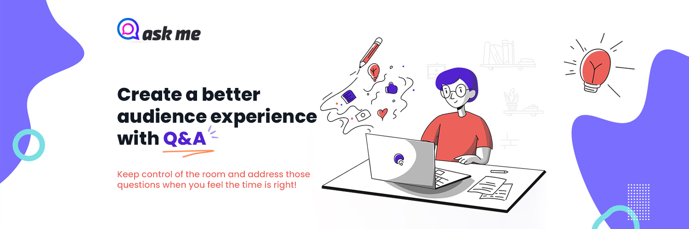

<h1 align="center">
  
</h1>

<h4 align="center">
  Create a better audience experience with Q&A
</h4>

<p align="center">
  

  

  <a href="https://www.linkedin.com/in/viniciumedeiros/">
    
  </a>

  <a href="https://github.com/viniciumedeiros/askme/commits/master">
    
  </a>

  
   <a href="https://github.com/viniciumedeiros/askme/stargazers">
    
  </a>
</p>
<p align="center">
  <a href="#-project">Project</a>&nbsp;&nbsp;&nbsp;|&nbsp;&nbsp;&nbsp;
  <a href="#-technologies">Technologies</a>&nbsp;&nbsp;&nbsp;|&nbsp;&nbsp;&nbsp;
  <a href="#-how-to-use">How to use</a>&nbsp;&nbsp;&nbsp;|&nbsp;&nbsp;&nbsp;
  <a href="#-how-to-contribute">How to contribute</a>&nbsp;&nbsp;&nbsp;|&nbsp;&nbsp;&nbsp;
  <a href="#-license">License</a>
</p>

## 💻 Project

Ask Me is a free-to-use interactive presentation platform for hosting Live Q&A sessions.<br>
It can be difficult to manage all the questions in front of a large audience, especially if there is a time limit. Ask Me Q&A feature enables you to manage questions from the audience quickly and easily without having to use extra tech.<br>
Keep control of the room and address those questions when you feel the time is right!

<h1 align="center">
    
</h1>


## 🚀 Technologies

This project was developed with the following technologies:

- [ReactJS][reactjs]
- [Typescript][typescript]
- [Firebase][firebase]

## 🌍 How To Use

To clone and run this application, you'll need [Git](https://git-scm.com), [Node][node] + [Yarn][yarn] installed on your computer.

From your command line:

### Install AskMe

```bash
# Clone this repository
$ git clone https://github.com/viniciumedeiros/askme

# Go into the repository
$ cd askme/

# Install dependencies
$ yarn install

# Start server
$ yarn start

# running on port 3000
http://127.0.0.1:3000/
```

### Database Configuration

```bash
# Create .env.local file
cp .env.example .env.local

# Open the .env.local file and set your database credentials
REACT_APP_API_KEY=
REACT_APP_AUTH_DOMAIN=
REACT_APP_DATABASE_URL=
REACT_APP_PROJECT_ID=
REACT_APP_STORAGE_BUCKET=
REACT_APP_MESSAGING_SENDER_ID=
REACT_APP_APP_ID=

## 👽 How to contribute

-  Make a fork;
-  Create a branck with your feature: `git checkout -b my-feature`;
-  Commit changes: `git commit -m 'feat: My new feature'`;
-  Make a push to your branch: `git push origin my-feature`.

After merging your receipt request to done, you can delete a branch from yours.

## 📃 License

This project is under the MIT license. See the [LICENSE](https://github.com/viniciumedeiros/askme/blob/master/LICENSE) for details.

🎓 Made with by Vinícius Medeiros 👨🏻‍💻 [Get in touch!](https://www.linkedin.com/in/viniciumedeiros/)

[reactjs]: https://reactjs.org/
[typescript]: https://www.typescriptlang.org/
[firebase]: https://firebase.google.com/
[node]: https://nodejs.org/en/
[yarn]: https://yarnpkg.com/
